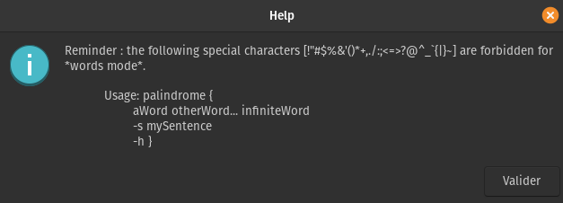

# palindrome

The palindrome.sh script checks if multiple words are palindromes and checks if a sentence is a palindrome.

__Note :__  
The script doesn't need [zenity](https://help.gnome.org/users/zenity/) package to be used.
______________________________________

# How to use it ?



- -s : option to check if a sentence is a palindrome
- -h : help (__without__ arguments -> help)

# Examples : 

* Words :

```
./palindrome.sh civic
civic is a palindrome.
```

```
./palindrome.sh CiVIC
CiVIC is a palindrome.
```

_"rêver" is a french word which means "dream" in English_

```
./palindrome.sh rÊvÊr
rÊvÊr is a palindrome.
```

```
./palindrome.sh Racecar Stats Tenet LiNuX
Racecar is a palindrome.
Stats is a palindrome.
Tenet is a palindrome
LiNuX is not a palindrome.
```

* Sentences :

```
./palindrome.sh -s Anne, I stay a day at Sienna.
"Anne, I stay a day at Sienna" is a palindrome.
```

```
./palindrome.sh -s Was it a cat I saw?
"Was it a cat I saw?" is a palindrome.
```

__- If palindrome.sh is in /usr/bin _(and rename in palindrome)_, then :__

* Words :

```
palindrome kayak
kayak is a palindrome.
```
_"été" is a french word which means "summer" in English_

```
palindrome Wow éTé Football LiNuX
Wow is a palindrome.
éTé is a palindrome.
Football is not a palindrome
LiNuX is not a palindrome.
```

* Sentences :

```
palindrome -s Are we not drawn onward, we few, drawn onward to new era?
"Are we not drawn onward, we few, drawn onward to new era?" is a palindrome.
```

_"Noir, ô hélas, Isis a le horion." is a french sentence which means "Black, oh alas, Isis has the horion." in English_

```
palindrome -s Noir, ô hélas, Isis a le horion.
"Noir, ô hélas, Isis a le horion." is a palindrome.
```