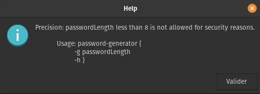

# password-generator

The password-generator.sh script generates a random password using the length (less than 8) chose by the user.  
The password must contain, __at least__, one uppercase letter, one lowercase letter, one number and one special character.

- If you don't know a specific length for your future password, __15__ is __recommended__ to have a strong and complex password.

__Note :__  
The script doesn't need [zenity](https://help.gnome.org/users/zenity/) package to be used.
______________________________________

# How to use it ?

- -g : option to generate a password with the length chose by the user
- -h : help (__without__ arguments -> help)
______________________________________

__Some references about the passwords :__  
- https://owasp.org/www-community/password-special-characters  
- https://en.wikipedia.org/wiki/Password_strength  
- https://www.quora.com/What-is-the-best-password-length 